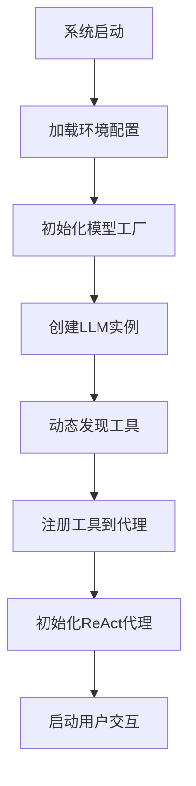
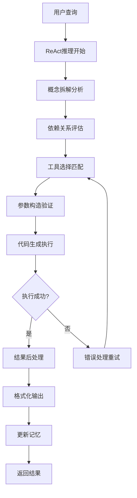

# Auto-GPT-Stock 智能金融分析系统架构详解

## 📖 文档概述

本文档详细解析基于AKShare的Auto-GPT-Stock智能金融分析系统的完整架构和工作原理，特别聚焦于链式推理（Chain-of-Thought）和ReAct架构的实现机制。

## 🏗️ 系统架构总览

### 核心组件架构图

```
┌─────────────────────────────────────────────────────────────┐
│                    Auto-GPT-Stock 系统                      │
├─────────────────────────────────────────────────────────────┤
│  ┌─────────────┐  ┌─────────────┐  ┌─────────────────────┐ │
│  │  用户接口   │  │  ReAct代理   │  │     工具系统        │ │
│  │ main.py     │◄►│ Agent/ReAct │◄►│    Tools/          │ │
│  └─────────────┘  └─────────────┘  └─────────────────────┘ │
├─────────────────────────────────────────────────────────────┤
│  ┌─────────────┐  ┌─────────────┐  ┌─────────────────────┐ │
│  │ 模型工厂    │  │ 提示工程    │  │     数据层          │ │
│  │ Models/     │  │ prompts/    │  │    data/           │ │
│  └─────────────┘  └─────────────┘  └─────────────────────┘ │
├─────────────────────────────────────────────────────────────┤
│  ┌─────────────────────────────────────────────────────┐   │
│  │                 AKShare 数据源                     │   │
│  └─────────────────────────────────────────────────────┘   │
└─────────────────────────────────────────────────────────────┘
```

## 🤖 ReAct 推理引擎详解

### ReAct 架构核心原理

ReAct（Reasoning + Acting）是一种将推理（Reasoning）和行动（Acting）相结合的架构模式。该系统通过以下循环实现智能决策：

```
用户查询 → 推理过程 → 工具选择 → 执行行动 → 观察结果 → 反思调整 → 最终回答
```

### 推理链详细流程

#### 1. 任务接收与初始分析

**输入**: 用户查询（如"分析002182最近60天的股价走势和MA20指标"）

**初始推理过程**:
```json
{
  "关键概念": "002182股价走势分析, MA20指标计算",
  "概念拆解": [
    "- 股票代码: 002182 (已知)",
    "- 时间周期: 最近60天 (已知)",
    "- 技术指标: MA20 (已知)",
    "- 数据源: AKShare历史数据接口"
  ]
}
```

#### 2. 反思与历史分析

**反思机制**:
```json
{
  "反思": {
    "已获取信息": "股票代码002182, 时间周期60天",
    "缺失信息": "历史股价数据, MA20计算",
    "上次执行状态": "首次执行，无历史记录",
    "依赖关系": "需要先获取历史数据才能计算MA20"
  }
}
```

#### 3. 思考与策略规划

**思考过程**:
```json
{
  "思考": {
    "依赖分析": "历史数据 → MA20计算 → 趋势分析",
    "优先级排序": [
      "1. 获取历史数据 (基础依赖)",
      "2. 计算技术指标 (数据处理)",
      "3. 生成分析报告 (最终输出)"
    ],
    "工具选择策略": "选择stock_zh_a_hist接口获取历史数据",
    "效率考虑": "一次性获取60天数据，避免多次API调用"
  }
}
```

#### 4. 推理与计划制定

**推理逻辑**:
```json
{
  "推理": {
    "工具匹配": "stock_zh_a_hist - 获取A股历史行情数据",
    "参数构造": {
      "symbol": "002182",
      "period": "daily",
      "start_date": "2024-08-01",
      "end_date": "2024-12-31",
      "adjust": ""
    },
    "代码生成策略": "基于示例模板动态生成调用代码"
  }
}
```

#### 5. 计划校验与优化

**计划校验流程**:
```json
{
  "计划校验": {
    "常量验证": "所有参数都有明确值，无需假设",
    "依赖检查": "历史数据接口独立，无外部依赖",
    "假设检查": "无假设性参数，完全基于已知信息",
    "效率评估": "单次API调用获取全部所需数据"
  }
}
```

### 工具选择与执行机制

#### 工具选择算法

```python
def select_tool(self, query: str) -> Tool:
    """
    基于语义相似度和功能匹配选择最合适的工具

    算法步骤:
    1. 解析查询意图
    2. 计算工具相关性得分
    3. 选择最高得分工具
    4. 验证参数完整性
    """
    # LLM驱动的工具选择逻辑
    tool_selection_prompt = f"""
    根据用户查询选择最合适的工具:

    查询: {query}

    可用工具列表:
    {self.list_available_tools()}

    请返回最匹配的工具名称和使用理由。
    """

    response = self.llm.invoke(tool_selection_prompt)
    selected_tool_name = self.parse_tool_selection(response)

    return self.get_tool_by_name(selected_tool_name)
```

#### 动态代码生成

```python
def generate_execution_code(self, tool: Tool, query: str) -> str:
    """
    基于工具元数据和用户查询生成可执行代码

    生成策略:
    1. 提取工具的示例代码模板
    2. 根据查询意图调整参数
    3. 构造完整的数据处理流程
    4. 添加错误处理和结果输出
    """

    # 工具元数据
    metadata = tool.metadata
    example_code = metadata['example']
    data_sample = metadata['data_sample']

    # 代码生成提示
    code_generation_prompt = f"""
    基于以下信息生成Python代码:

    工具: {tool.name}
    描述: {tool.description}
    示例代码: {example_code}
    数据格式: {data_sample}
    用户查询: {query}

    要求:
    1. 代码必须可直接执行
    2. 包含数据获取和处理逻辑
    3. 最终通过print输出结果
    4. 只使用akshare, pandas等指定库
    """

    generated_code = self.llm.invoke(code_generation_prompt)

    # 代码验证和修复
    validated_code = self.validate_and_fix_code(generated_code)

    return validated_code
```

## 🛠️ 工具系统架构

### 工具注册机制

#### 动态工具发现

```python
class ToolRegistry:
    """
    工具注册表，自动发现和注册所有可用工具
    """

    def __init__(self):
        self.tools = {}
        self._auto_discover_tools()

    def _auto_discover_tools(self):
        """
        从数据文件自动发现工具
        """
        data_files = {
            'stock_quote': './data/stock.md.txt',
            'futures': './data/futures.md.txt',
            'fund_public': './data/fund_public.md.txt',
            'fund_private': './data/fund_private.md.txt'
        }

        for category, file_path in data_files.items():
            tools = self._parse_tools_from_file(file_path)
            self.tools[category] = tools

    def _parse_tools_from_file(self, file_path: str) -> List[Tool]:
        """
        从Markdown文件解析工具定义
        """
        tools = []

        with open(file_path, 'r', encoding='utf-8') as f:
            content = f.read()

        # 正则表达式解析工具定义
        tool_pattern = r'接口:\s*(\w+).*?描述:\s*(.*?)(?=接口:|$)'
        matches = re.findall(tool_pattern, content, re.DOTALL)

        for name, description in matches:
            tool = self._create_tool_from_metadata(name, description)
            tools.append(tool)

        return tools
```

### 工具执行流程

#### 1. 工具实例化

```python
def create_financial_analyzer(self, category: str) -> FinancialAnalyzer:
    """
    创建金融数据分析器

    Args:
        category: 工具类别 (stock, futures, fund等)

    Returns:
        配置完整的分析器实例
    """
    # 获取LLM实例
    llm = ChatModelFactory.get_model(os.getenv('MODEL_NAME'))

    # 获取对应类别的工具
    tools = self.get_tools_by_category(category)

    # 创建分析器
    analyzer = StockAnalyser(
        llm=llm,
        prompt_file=f'./prompts/tools/{category}.txt',
        verbose=True
    )

    # 设置工具
    analyzer.set_tools(tools)

    return analyzer
```

#### 2. 工具执行与结果处理

```python
def execute_tool_with_fallback(self, tool: Tool, params: dict) -> dict:
    """
    执行工具并处理异常情况

    执行策略:
    1. 参数验证
    2. 工具执行
    3. 结果验证
    4. 错误处理和重试
    """

    try:
        # 参数预处理
        validated_params = self._validate_parameters(tool, params)

        # 执行工具
        result = tool.run(validated_params)

        # 结果后处理
        processed_result = self._post_process_result(result)

        return {
            'status': 'success',
            'data': processed_result,
            'execution_time': time.time() - start_time
        }

    except ValidationError as e:
        return self._handle_validation_error(e)

    except APIError as e:
        return self._handle_api_error(e)

    except Exception as e:
        return self._handle_unexpected_error(e)
```

## 📊 数据处理流水线

### AKShare数据集成

#### 数据获取流程

```python
class AKShareDataProvider:
    """
    AKShare数据提供者，统一管理所有金融数据接口
    """

    def __init__(self):
        self._init_akshare()

    def get_historical_data(self, symbol: str, **kwargs) -> pd.DataFrame:
        """
        获取历史行情数据

        Args:
            symbol: 股票代码
            **kwargs: 其他参数 (period, start_date, end_date等)

        Returns:
            历史行情数据DataFrame
        """
        try:
            # 参数验证
            self._validate_symbol(symbol)

            # 调用AKShare接口
            data = ak.stock_zh_a_hist(
                symbol=symbol,
                period=kwargs.get('period', 'daily'),
                start_date=kwargs.get('start_date'),
                end_date=kwargs.get('end_date'),
                adjust=kwargs.get('adjust', '')
            )

            # 数据质量检查
            data = self._clean_data(data)

            # 添加技术指标
            data = self._add_technical_indicators(data)

            return data

        except Exception as e:
            logger.error(f"获取历史数据失败: {str(e)}")
            raise DataFetchError(f"无法获取{symbol}的历史数据")

    def _add_technical_indicators(self, data: pd.DataFrame) -> pd.DataFrame:
        """
        添加技术指标计算
        """
        # MA20计算
        data['MA20'] = data['收盘'].rolling(window=20).mean()

        # MACD计算
        data['EMA12'] = data['收盘'].ewm(span=12).mean()
        data['EMA26'] = data['收盘'].ewm(span=26).mean()
        data['MACD'] = data['EMA12'] - data['EMA26']
        data['Signal'] = data['MACD'].ewm(span=9).mean()

        return data
```

### 数据分析引擎

#### 技术指标计算

```python
class TechnicalAnalyzer:
    """
    技术分析引擎，提供各种技术指标计算
    """

    @staticmethod
    def calculate_ma(data: pd.DataFrame, period: int = 20) -> pd.Series:
        """计算移动平均线"""
        return data['收盘'].rolling(window=period).mean()

    @staticmethod
    def calculate_rsi(data: pd.DataFrame, period: int = 14) -> pd.Series:
        """计算RSI指标"""
        delta = data['收盘'].diff()
        gain = (delta.where(delta > 0, 0)).rolling(window=period).mean()
        loss = (-delta.where(delta < 0, 0)).rolling(window=period).mean()
        rs = gain / loss
        return 100 - (100 / (1 + rs))

    @staticmethod
    def calculate_bollinger_bands(data: pd.DataFrame, period: int = 20) -> dict:
        """计算布林带"""
        ma = data['收盘'].rolling(window=period).mean()
        std = data['收盘'].rolling(window=period).std()

        return {
            'upper': ma + (std * 2),
            'middle': ma,
            'lower': ma - (std * 2)
        }
```

## 🔄 完整工作流程

### 系统启动流程



### 单次查询处理流程



### 实际运行示例

#### 示例1: 股价走势分析

**用户查询**: "分析002182最近60天的股价走势和MA20指标"

**推理链**:
```json
{
  "第1步-思考": {
    "关键概念": "002182股价分析, MA20指标",
    "概念拆解": [
      "- 股票代码: 002182 ✓",
      "- 时间范围: 最近60天 ✓",
      "- 技术指标: MA20 ✓"
    ]
  },
  "第2步-反思": {
    "已有信息": "股票代码和时间范围明确",
    "缺失信息": "历史股价数据",
    "执行策略": "选择stock_zh_a_hist接口"
  },
  "第3步-推理": {
    "工具选择": "stock_zh_a_hist (历史行情数据)",
    "参数构造": {
      "symbol": "002182",
      "start_date": "2024-08-01",
      "end_date": "2024-12-31"
    }
  },
  "第4步-执行": {
    "生成的代码": "ak.stock_zh_a_hist(symbol='002182', period='daily', start_date='2024-08-01', end_date='2024-12-31', adjust='')",
    "数据处理": "计算MA20指标，分析走势"
  }
}
```

**最终输出**:
```
根据最近60天的002182股价数据分析：

📈 股价走势：
- 期间最高价: XX.XX元 (日期: XXXX-XX-XX)
- 期间最低价: XX.XX元 (日期: XXXX-XX-XX)
- 平均收盘价: XX.XX元

📊 MA20指标分析：
- 当前MA20: XX.XX元
- MA20趋势: 📈 上升通道
- 股价与MA20关系: 目前股价在MA20上方X%

💡 投资建议：
基于MA20指标分析，当前处于...
```

## 🔧 配置与部署

### 环境配置

#### .env文件配置

```bash
# 模型配置
MODEL_NAME=kimi
MOONSHOT_API_KEY=sk-your-kimi-api-key

# DeepSeek配置（备用）
DEEPSEEK_API_KEY=sk-your-deepseek-key

# 系统配置
VERBOSE=true
MAX_THOUGHT_STEPS=20
```

### 依赖管理

#### pyproject.toml配置

```toml
[tool.poetry]
name = "auto-gpt-stock"
version = "1.0.0"
description = "基于AKShare的智能金融分析系统"

[tool.poetry.dependencies]
python = "^3.8"
langchain = "^0.1.0"
langchain-openai = "^0.0.8"
langchain-community = "^0.0.13"
langchain-experimental = "^0.0.15"
akshare = "^1.12.0"
python-dotenv = "^1.0.0"
pydantic = "^2.0.0"
pandas = "^2.0.0"
openpyxl = "^3.1.0"
colorama = "^0.4.6"
```

### 部署步骤

```bash
# 1. 克隆项目
git clone https://github.com/IndigoBlueInChina/Auto-GPT-Stock.git
cd Auto-GPT-Stock

# 2. 创建虚拟环境
python3 -m venv venv
source venv/bin/activate  # Linux/Mac
# 或
venv\Scripts\activate     # Windows

# 3. 安装依赖
pip install poetry
poetry install

# 4. 配置环境变量
cp demo.env .env
# 编辑.env文件，配置API密钥

# 5. 运行系统
python main.py
```

## 📈 性能优化

### 缓存策略

```python
class CacheManager:
    """
    多层缓存管理器
    """

    def __init__(self):
        self.memory_cache = {}  # 内存缓存
        self.file_cache = {}    # 文件缓存
        self.redis_cache = None # Redis缓存（可选）

    def get(self, key: str):
        """多级缓存查询"""
        # 1. 内存缓存
        if key in self.memory_cache:
            return self.memory_cache[key]

        # 2. 文件缓存
        cached_data = self._load_from_file(key)
        if cached_data:
            self.memory_cache[key] = cached_data
            return cached_data

        return None

    def set(self, key: str, value, ttl: int = 3600):
        """设置缓存"""
        self.memory_cache[key] = value
        self._save_to_file(key, value, ttl)
```

### 并发处理

```python
class AsyncToolExecutor:
    """
    异步工具执行器，支持并发处理多个查询
    """

    async def execute_parallel(self, queries: List[str]) -> List[dict]:
        """
        并行执行多个查询
        """
        tasks = []
        for query in queries:
            task = asyncio.create_task(self._execute_single_query(query))
            tasks.append(task)

        results = await asyncio.gather(*tasks)
        return results

    async def _execute_single_query(self, query: str) -> dict:
        """
        执行单个查询
        """
        # 创建独立的推理上下文
        agent = self._create_agent_instance()

        # 执行推理链
        result = await agent.run_async(query)

        return result
```

## 🔍 监控与调试

### 日志系统

```python
class LoggingManager:
    """
    统一日志管理
    """

    def __init__(self):
        self.logger = logging.getLogger('AutoGPTStock')
        self._setup_logging()

    def _setup_logging(self):
        """配置日志格式"""
        formatter = logging.Formatter(
            '%(asctime)s - %(name)s - %(levelname)s - %(message)s'
        )

        # 控制台输出
        console_handler = logging.StreamHandler()
        console_handler.setFormatter(formatter)

        # 文件输出
        file_handler = logging.FileHandler('logs/autogpt_stock.log')
        file_handler.setFormatter(formatter)

        self.logger.addHandler(console_handler)
        self.logger.addHandler(file_handler)
        self.logger.setLevel(logging.INFO)

    def log_inference_chain(self, chain_data: dict):
        """记录推理链执行过程"""
        self.logger.info(f"Inference Chain: {json.dumps(chain_data, ensure_ascii=False)}")
```

### 性能监控

```python
class PerformanceMonitor:
    """
    性能监控器
    """

    def __init__(self):
        self.metrics = {}

    def start_timer(self, operation: str):
        """开始计时"""
        self.metrics[operation] = {
            'start_time': time.time(),
            'status': 'running'
        }

    def end_timer(self, operation: str):
        """结束计时"""
        if operation in self.metrics:
            self.metrics[operation]['end_time'] = time.time()
            self.metrics[operation]['duration'] = (
                self.metrics[operation]['end_time'] -
                self.metrics[operation]['start_time']
            )
            self.metrics[operation]['status'] = 'completed'

    def get_metrics_report(self) -> dict:
        """生成性能报告"""
        return {
            'total_operations': len(self.metrics),
            'average_duration': self._calculate_average_duration(),
            'slowest_operation': self._find_slowest_operation(),
            'fastest_operation': self._find_fastest_operation()
        }
```

## 🎯 扩展指南

### 添加新工具

#### 1. 在数据文件中定义工具

```markdown
#### 新的金融数据接口

接口: new_financial_data

目标地址: https://example.com/api

描述: 获取新的金融数据

限量: 单次返回最新数据

输入参数

| 名称  | 类型  | 描述      |
|-----|-----|---------|
| code | str | 数据代码    |

输出参数

| 名称  | 类型     | 描述  |
|-----|--------|-----|
| data | object | 数据内容 |

接口示例

```python
import akshare as ak

result = ak.new_financial_data(code="example")
print(result)
```

数据示例

```
   data
0  example_data
```
```

#### 2. 系统自动发现

系统启动时会自动解析新的工具定义，无需修改代码。

### 添加新模型支持

```python
# 在 Models/Factory.py 中添加

elif model_name == "new_model":
    return ChatOpenAI(
        model="new-model-name",
        api_key=os.getenv("NEW_MODEL_API_KEY"),
        base_url="https://new-model-api.com/v1",
        **cls.model_params,
    )
```

### 添加新的分析功能

```python
class NewFinancialAnalyzer(StockAnalyser):
    """
    新的金融分析器
    """

    def __init__(self, llm, prompt_file, verbose):
        super().__init__(llm, prompt_file, verbose)
        # 添加新的分析逻辑

    def analyze_new_metric(self, data: pd.DataFrame) -> dict:
        """
        实现新的分析指标
        """
        # 新的分析算法
        pass
```

## 📚 最佳实践

### 查询优化

1. **具体化查询**: 使用具体的股票代码和时间范围
2. **明确指标**: 清楚说明需要的技术指标
3. **合理范围**: 避免过大的数据请求

### 错误处理

1. **参数验证**: 确保所有必需参数都已提供
2. **异常捕获**: 处理网络超时、API限流等异常
3. **降级策略**: 当主接口失败时使用备用方案

### 性能调优

1. **缓存利用**: 对频繁查询的数据使用缓存
2. **并发控制**: 合理控制并发请求数量
3. **数据分页**: 对大量数据进行分页处理

## 🔄 更新日志

### v1.0.0 (2024-12-XX)
- ✅ 完成基础ReAct架构实现
- ✅ 支持AKShare数据集成
- ✅ 实现动态工具发现机制
- ✅ 添加多模型支持
- ✅ 实现完整的推理链追踪

### 未来规划
- 🔄 添加实时数据流处理
- 🔄 实现分布式部署支持
- 🔄 集成更多数据源
- 🔄 优化推理性能

---

本文档详细介绍了Auto-GPT-Stock系统的完整架构和工作原理。通过ReAct推理引擎、动态工具系统和AKShare数据集成，该系统能够智能地处理复杂的金融数据分析任务。
