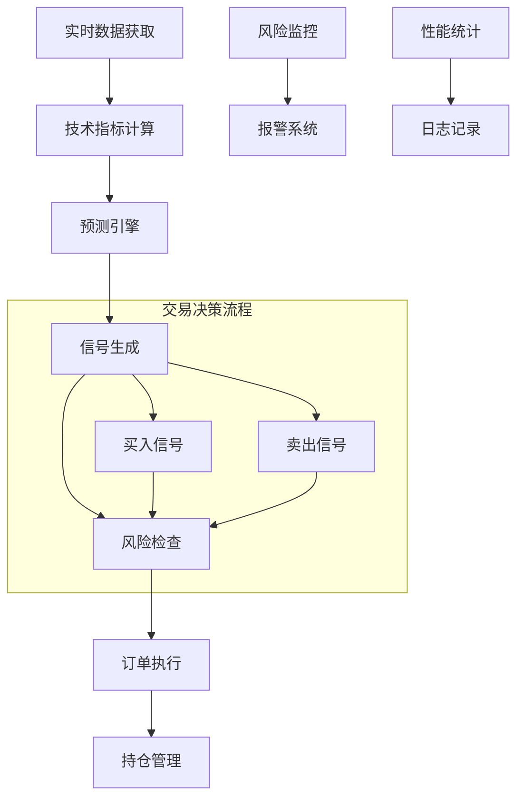

# 实盘交易系统使用指南

## 📋 概述

本系统将回测算法成功转换为实盘交易策略，支持自动化股票交易。基于技术指标分析和概率预测，实现智能买卖决策。

## 🎯 核心特性

### ✅ **算法移植**
- **预测引擎**: 基于MA、RSI、成交量等技术指标
- **Kelly仓位管理**: 动态计算最优持仓比例
- **风险控制**: 止损、时间止损、仓位限制
- **买卖决策**: 与回测系统完全一致的交易逻辑

### ✅ **系统功能**
- **实时数据**: AKShare接口获取实时行情
- **自动交易**: 全自动信号生成和订单执行
- **风险监控**: 实时持仓风险检测和报警
- **性能追踪**: 详细的交易记录和性能统计

### ✅ **安全保障**
- **纸面交易**: 虚拟资金测试模式
- **风险控制**: 多层次风险管理机制
- **紧急停止**: 异常情况自动停止交易
- **日志记录**: 完整的操作和决策日志

## 🚀 快速开始

### 1. 环境准备

```bash
# 安装依赖
pip install akshare pandas numpy pyyaml asyncio

# 检查Python版本 (需要3.7+)
python --version
```

### 2. 配置设置

编辑 `trading_config.yaml` 配置文件：

```yaml
# 基础策略参数
strategy:
  buy_threshold: 0.6          # 买入概率阈值
  sell_threshold: 0.4         # 卖出概率阈值
  max_positions: 10           # 最大持仓数
  initial_capital: 100000     # 初始资金

# 风险控制
risk_management:
  stop_loss_threshold: 0.03   # 3%止损
  max_single_position: 0.15   # 单股最大15%
  max_daily_loss: 0.02        # 日最大亏损2%

# 监控股票
watchlist:
  default_symbols:
    - "000001"  # 平安银行
    - "600519"  # 贵州茅台
    - "000858"  # 五粮液
```

### 3. 启动方式

#### 🧪 **纸面交易模式（推荐新手）**
```bash
python start_live_trading.py --paper
```

#### 🔍 **干运行模式（仅生成信号）**
```bash
python start_live_trading.py --dry-run
```

#### 💰 **实盘交易模式**
```bash
python start_live_trading.py
```

#### 📊 **自定义股票池**
```bash
python start_live_trading.py --watchlist 000001 600519 000858
```

## 📊 系统架构

### 核心组件



### 数据流

1. **数据获取**: AKShare → 实时行情数据
2. **指标计算**: 历史数据 → MA/RSI/成交量指标
3. **概率预测**: 技术指标 → 上涨概率
4. **信号生成**: 概率阈值 → 买卖信号
5. **风险检查**: 资金/仓位/止损检查
6. **订单执行**: 券商接口 → 实际交易

## ⚙️ 交易策略详解

### 买入条件
```python
买入信号 = (
    预期收益 > -1% AND
    预测概率 > 买入阈值(0.6) AND
    风险调整收益 > -10% AND
    (新股票 OR 概率提升5%以上可加仓)
)
```

### 卖出条件
```python
卖出信号 = (
    预测概率 < 卖出阈值(0.4) OR
    (持仓>5天 AND 亏损>1%) OR
    亏损 > 3% OR
    持仓 > 15天
)
```

### 仓位管理
```python
# Kelly公式计算最优仓位
kelly_fraction = (胜率 × 盈利 - 败率 × 亏损) / 盈利
最终仓位 = min(kelly_fraction, 基础仓位比例, 25%)
```

## 🛡️ 风险控制

### 多层次风险管理

#### 1. 资金风险控制
- ✅ **资金检查**: 买入前验证可用资金
- ✅ **仓位限制**: 单股最大15%，总仓位95%
- ✅ **日亏损限制**: 单日最大亏损2%

#### 2. 持仓风险控制
- ✅ **止损机制**: 个股亏损3%自动止损
- ✅ **时间止损**: 持仓超过15天强制卖出
- ✅ **行业集中度**: 单行业最大30%

#### 3. 系统风险控制
- ✅ **数据中断检测**: 数据源异常自动停止
- ✅ **连续亏损保护**: 连续5次亏损暂停交易
- ✅ **紧急停止**: 手动或自动紧急停止机制

### 风险监控指标

| 风险类型 | 监控指标 | 阈值 | 处理方式 |
|---------|---------|------|----------|
| 个股风险 | 单股亏损 | 3% | 自动止损 |
| 组合风险 | 日总亏损 | 2% | 停止新开仓 |
| 流动性风险 | 持仓天数 | 15天 | 强制卖出 |
| 集中度风险 | 行业占比 | 30% | 限制新增 |
| 系统风险 | 数据中断 | 5分钟 | 暂停交易 |

## 📈 性能监控

### 实时监控指标

```python
# 获取实时性能摘要
summary = engine.get_performance_summary()

{
    'total_capital': 101259.30,     # 总资产
    'cash': 85420.15,               # 现金
    'market_value': 15839.15,       # 持仓市值
    'unrealized_pnl': 1259.30,     # 未实现盈亏
    'total_trades': 24,             # 总交易次数
    'positions_count': 3,           # 当前持仓数
    'watch_list_size': 8            # 监控股票数
}
```

### 关键性能指标

- **总收益率**: (当前资产 - 初始资金) / 初始资金
- **夏普比率**: 超额收益 / 收益波动率
- **最大回撤**: 资产峰值到谷值的最大跌幅
- **胜率**: 盈利交易数 / 总交易数
- **平均持仓期**: 所有交易的平均持有天数

## 🔧 高级配置

### 1. 策略参数优化

```yaml
# 启用参数自动优化
optimization:
  enabled: true
  optimization_interval: 7      # 每7天优化一次
  lookback_period: 30          # 基于30天数据优化
  
  parameters:
    buy_threshold:
      min: 0.5
      max: 0.8
      step: 0.05
```

### 2. 市场状态适应

```yaml
# 根据市场状态调整策略
market_regime:
  enabled: true
  
  adjustments:
    bull_market:                 # 牛市
      position_size_multiplier: 1.2
      buy_threshold_adjustment: -0.05
    
    bear_market:                 # 熊市
      position_size_multiplier: 0.8
      sell_threshold_adjustment: 0.05
```

### 3. 报警系统

```yaml
# 多渠道报警
alerts:
  enabled: true
  channels:
    - type: "email"
      recipients: ["trader@example.com"]
    
    - type: "wechat"
      webhook_url: "https://..."
    
  conditions:
    - type: "stop_loss"
      threshold: 0.03
      severity: "HIGH"
```

## 📝 使用示例

### 基础使用

```python
import asyncio
from live_trading_engine import LiveTradingEngine, LiveTradingConfig

async def basic_trading():
    # 创建配置
    config = LiveTradingConfig()
    config.initial_capital = 50000  # 5万启动资金
    config.max_positions = 5        # 最多5只股票
    
    # 创建引擎
    engine = LiveTradingEngine(config)
    
    # 添加监控股票
    engine.add_to_watchlist(['000001', '600519', '000858'])
    
    # 启动交易
    await engine.run_trading_loop()

# 运行
asyncio.run(basic_trading())
```

### 自定义策略

```python
class CustomTradingEngine(LiveTradingEngine):
    """自定义交易引擎"""
    
    def _check_buy_signal(self, symbol, prediction):
        """自定义买入逻辑"""
        # 在原有逻辑基础上添加自定义条件
        base_signal = super()._check_buy_signal(symbol, prediction)
        
        if base_signal:
            # 添加额外条件，如：
            # - 行业轮动检查
            # - 基本面筛选
            # - 技术形态确认
            pass
        
        return base_signal
```

## ⚠️ 注意事项

### 🔴 **重要风险提示**

1. **资金安全**: 
   - 建议先用小资金测试（1-2万）
   - 充分验证策略稳定性后再增加资金
   - 设置合理的止损和仓位限制

2. **市场风险**:
   - 股市有风险，投资需谨慎
   - 算法无法预测所有市场情况
   - 极端行情下可能出现较大亏损

3. **技术风险**:
   - 系统可能出现故障或异常
   - 网络中断可能影响交易执行
   - 数据源问题可能导致错误决策

### ✅ **最佳实践**

1. **渐进式部署**:
   ```bash
   # 第1周：纸面交易测试
   python start_live_trading.py --paper
   
   # 第2-3周：小资金实盘测试
   # 修改配置：initial_capital: 10000
   
   # 第4周后：根据表现决定是否增加资金
   ```

2. **定期监控**:
   - 每日检查交易日志
   - 每周分析性能报告
   - 每月评估策略有效性

3. **参数调优**:
   - 根据市场变化调整阈值
   - 基于历史表现优化参数
   - 定期回测验证策略有效性

## 📞 技术支持

### 常见问题

**Q: 系统提示"数据获取失败"怎么办？**
A: 检查网络连接，确认AKShare可以正常访问，必要时切换数据源。

**Q: 如何调整买卖阈值？**
A: 修改 `trading_config.yaml` 中的 `buy_threshold` 和 `sell_threshold` 参数。

**Q: 可以同时运行多个策略吗？**
A: 可以，为不同策略创建不同的配置文件和实例。

**Q: 如何备份交易数据？**
A: 系统会自动保存交易日志到 `logs/trading.log` 和数据库文件。

### 日志分析

```bash
# 查看实时日志
tail -f logs/trading.log

# 筛选交易记录
grep "交易执行成功" logs/trading.log

# 查看风险警报
grep "风险警报" logs/trading.log
```

---

## 🎉 总结

这个实盘交易系统成功将回测算法转换为可实际运行的交易策略，具备：

- ✅ **完整的算法移植**: 预测、决策、仓位管理
- ✅ **全面的风险控制**: 多层次风险管理机制
- ✅ **灵活的配置系统**: 支持各种参数调整
- ✅ **详细的监控日志**: 完整的操作记录
- ✅ **渐进式部署**: 从纸面交易到实盘交易

通过合理配置和谨慎使用，可以实现从理论验证到实际盈利的转换。

**⚠️ 最后提醒**: 实盘交易涉及真实资金风险，请务必充分测试和理解系统后再投入大额资金！
