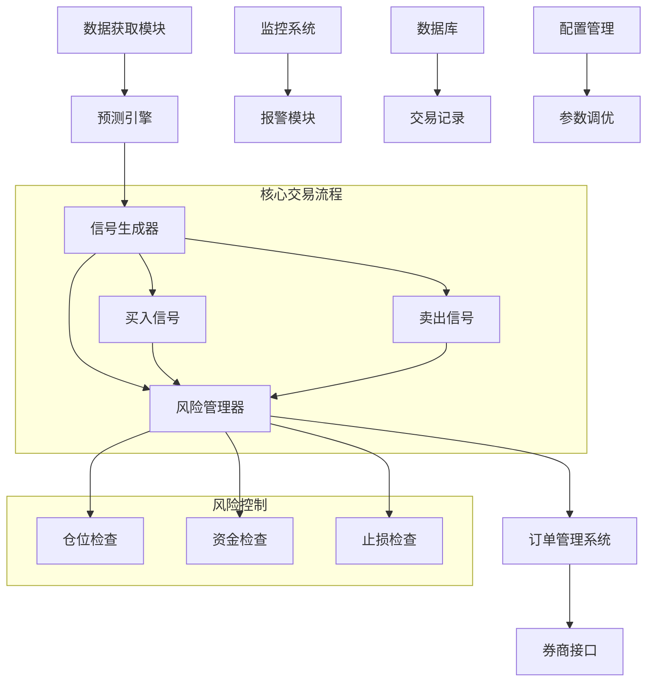

# 实盘交易策略实施方案

## 📋 概述

本文档详细说明如何将当前的回测逻辑算法转换为可实际运行的交易策略系统，包括系统架构、核心算法、风险控制和实施步骤。

## 🎯 当前回测算法分析

### 核心交易逻辑

#### 1. 预测生成系统
```python
# 基于技术指标生成预测概率
def generate_prediction_probability(stock_data):
    """
    技术指标组合：
    - MA5/MA20 均线系统
    - RSI 相对强弱指标
    - 成交量相对强度
    - 价格相对位置
    """
    score = 0
    if current_price > ma5: score += 0.2
    if current_price > ma20: score += 0.3
    if 30 < rsi < 70: score += 0.1
    if volume_ratio > 1.2: score += 0.15
    if price_position > 0: score += 0.25
    
    # 转换为概率（0-1）
    probability = max(0.1, min(0.9, 0.5 + score - 0.5))
    return probability
```

#### 2. 买入决策算法
```python
# 买入条件组合判断
buy_conditions = [
    expected_return > -0.01,           # 预期收益大于-1%
    probability > buy_threshold,       # 预测概率超过阈值（默认0.6）
    risk_adjusted_return > -0.1,       # 风险调整收益大于-10%
    current_positions < max_positions,  # 未达到最大持仓数
    can_buy_or_add_position           # 可以买入或加仓
]

# 加仓条件
add_position_condition = (
    symbol in positions and 
    new_probability > last_probability + 0.05  # 概率提升5%以上
)
```

#### 3. Kelly公式仓位管理
```python
def calculate_kelly_fraction(probability, expected_return):
    """
    Kelly公式：f = (bp - q) / b
    - b: 赔率 (expected_return)
    - p: 胜率 (probability)
    - q: 败率 (1 - probability)
    """
    if probability <= 0.5 or expected_return <= 0:
        return 0.0
    
    win_prob = probability
    lose_prob = 1 - probability
    win_amount = expected_return
    lose_amount = expected_return / 2  # 假设亏损幅度较小
    
    kelly_fraction = (win_prob * win_amount - lose_prob * lose_amount) / win_amount
    return max(0, min(kelly_fraction, 0.25))  # 限制最大25%仓位
```

#### 4. 卖出决策算法
```python
# 动态卖出条件
sell_conditions = [
    probability < sell_threshold,                    # 概率低于卖出阈值
    (days_held > 5 and unrealized_return < -0.01), # 持有超过5天且亏损1%
    unrealized_return < -0.03,                      # 亏损超过3%（止损）
    days_held > 15                                  # 持有超过15天（时间止损）
]
```

## 🏗️ 实盘交易系统架构

### 系统组件设计



### 1. 数据获取模块 (DataProvider)
```python
class RealTimeDataProvider:
    """实时数据获取器"""
    
    def __init__(self):
        self.ak_client = akshare  # AKShare实时数据
        self.cache = {}
        self.update_interval = 60  # 60秒更新一次
    
    def get_real_time_price(self, symbol: str) -> Dict:
        """获取实时价格数据"""
        try:
            # 获取实时行情
            df = ak.stock_zh_a_spot_em()
            stock_data = df[df['代码'] == symbol]
            
            if not stock_data.empty:
                return {
                    'symbol': symbol,
                    'price': float(stock_data['最新价'].iloc[0]),
                    'change_pct': float(stock_data['涨跌幅'].iloc[0]),
                    'volume': int(stock_data['成交量'].iloc[0]),
                    'timestamp': datetime.now()
                }
        except Exception as e:
            logger.error(f"获取实时数据失败: {e}")
            return None
    
    def get_historical_data(self, symbol: str, days: int = 30) -> pd.DataFrame:
        """获取历史数据用于技术指标计算"""
        end_date = datetime.now().strftime('%Y%m%d')
        start_date = (datetime.now() - timedelta(days=days)).strftime('%Y%m%d')
        
        return ak.stock_zh_a_hist(symbol=symbol, period="daily", 
                                 start_date=start_date, end_date=end_date)
```

### 2. 预测引擎 (PredictionEngine)
```python
class RealTimePredictionEngine:
    """实时预测引擎"""
    
    def __init__(self):
        self.indicators_calculator = TechnicalIndicators()
        self.model_weights = {
            'ma_signal': 0.3,
            'rsi_signal': 0.2, 
            'volume_signal': 0.15,
            'price_position': 0.25,
            'momentum': 0.1
        }
    
    def generate_prediction(self, symbol: str) -> Dict:
        """生成实时预测"""
        # 获取历史数据
        hist_data = self.data_provider.get_historical_data(symbol)
        current_data = self.data_provider.get_real_time_price(symbol)
        
        # 计算技术指标
        indicators = self.indicators_calculator.calculate_all(hist_data)
        
        # 生成预测概率
        probability = self._calculate_probability(indicators, current_data)
        
        # 计算预期收益
        expected_return = self._calculate_expected_return(probability, indicators)
        
        return {
            'symbol': symbol,
            'probability': probability,
            'expected_return': expected_return,
            'confidence': self._calculate_confidence(indicators),
            'timestamp': datetime.now(),
            'indicators': indicators
        }
```

### 3. 信号生成器 (SignalGenerator)
```python
class TradingSignalGenerator:
    """交易信号生成器"""
    
    def __init__(self, config: StrategyConfig):
        self.config = config
        self.prediction_engine = RealTimePredictionEngine()
        self.position_manager = PositionManager()
    
    def generate_signals(self, watch_list: List[str]) -> List[TradingSignal]:
        """生成交易信号"""
        signals = []
        
        for symbol in watch_list:
            try:
                # 获取预测
                prediction = self.prediction_engine.generate_prediction(symbol)
                
                # 检查买入信号
                buy_signal = self._check_buy_signal(symbol, prediction)
                if buy_signal:
                    signals.append(buy_signal)
                
                # 检查卖出信号（已持仓股票）
                if symbol in self.position_manager.positions:
                    sell_signal = self._check_sell_signal(symbol, prediction)
                    if sell_signal:
                        signals.append(sell_signal)
                        
            except Exception as e:
                logger.error(f"生成信号失败 {symbol}: {e}")
        
        return signals
    
    def _check_buy_signal(self, symbol: str, prediction: Dict) -> Optional[TradingSignal]:
        """检查买入信号"""
        probability = prediction['probability']
        expected_return = prediction['expected_return']
        
        # 应用回测中的买入逻辑
        if (expected_return > -0.01 and 
            probability > self.config.buy_threshold and
            self._can_buy_or_add(symbol, probability)):
            
            # 计算Kelly仓位
            kelly_fraction = self._calculate_kelly_fraction(probability, expected_return)
            optimal_fraction = min(kelly_fraction, self.config.position_size)
            
            return TradingSignal(
                symbol=symbol,
                action='buy',
                probability=probability,
                expected_return=expected_return,
                position_size=optimal_fraction,
                timestamp=datetime.now(),
                reason=f"概率:{probability:.3f}, 预期收益:{expected_return:.3f}"
            )
        
        return None
```

### 4. 风险管理器 (RiskManager)
```python
class RiskManager:
    """风险管理器"""
    
    def __init__(self, config: RiskConfig):
        self.config = config
        self.position_manager = PositionManager()
        self.account_manager = AccountManager()
    
    def validate_order(self, signal: TradingSignal) -> Tuple[bool, str]:
        """验证订单是否符合风险控制要求"""
        
        # 1. 资金检查
        if signal.action == 'buy':
            required_capital = self._calculate_required_capital(signal)
            if required_capital > self.account_manager.available_cash:
                return False, f"资金不足: 需要{required_capital}, 可用{self.account_manager.available_cash}"
        
        # 2. 仓位检查
        current_positions = len(self.position_manager.positions)
        if signal.action == 'buy' and current_positions >= self.config.max_positions:
            return False, f"超过最大持仓数: {current_positions}/{self.config.max_positions}"
        
        # 3. 单股仓位检查
        if signal.action == 'buy':
            symbol_weight = self._calculate_symbol_weight(signal)
            if symbol_weight > self.config.max_single_position:
                return False, f"单股仓位过大: {symbol_weight:.2%} > {self.config.max_single_position:.2%}"
        
        # 4. 止损检查（卖出时）
        if signal.action == 'sell':
            position = self.position_manager.get_position(signal.symbol)
            if position:
                unrealized_pnl_pct = position.unrealized_pnl_percent
                if unrealized_pnl_pct < -self.config.stop_loss_threshold:
                    return True, f"触发止损: {unrealized_pnl_pct:.2%}"
        
        # 5. 集中度检查
        sector_concentration = self._check_sector_concentration(signal)
        if sector_concentration > self.config.max_sector_concentration:
            return False, f"行业集中度过高: {sector_concentration:.2%}"
        
        return True, "风险检查通过"
    
    def monitor_positions(self) -> List[RiskAlert]:
        """监控现有持仓风险"""
        alerts = []
        
        for symbol, position in self.position_manager.positions.items():
            # 止损监控
            if position.unrealized_pnl_percent < -self.config.stop_loss_threshold:
                alerts.append(RiskAlert(
                    type='STOP_LOSS',
                    symbol=symbol,
                    message=f"触发止损: {position.unrealized_pnl_percent:.2%}",
                    severity='HIGH'
                ))
            
            # 持仓时间监控
            holding_days = (datetime.now() - position.entry_date).days
            if holding_days > self.config.max_holding_days:
                alerts.append(RiskAlert(
                    type='LONG_HOLDING',
                    symbol=symbol,
                    message=f"持仓时间过长: {holding_days}天",
                    severity='MEDIUM'
                ))
        
        return alerts
```

### 5. 订单管理系统 (OrderManager)
```python
class OrderManager:
    """订单管理系统"""
    
    def __init__(self, broker_interface):
        self.broker = broker_interface
        self.pending_orders = {}
        self.executed_orders = []
        self.risk_manager = RiskManager()
    
    def submit_order(self, signal: TradingSignal) -> OrderResult:
        """提交订单"""
        
        # 风险检查
        risk_passed, risk_message = self.risk_manager.validate_order(signal)
        if not risk_passed:
            return OrderResult(
                success=False,
                message=f"风险检查失败: {risk_message}",
                order_id=None
            )
        
        try:
            # 创建订单
            order = self._create_order(signal)
            
            # 提交到券商
            order_result = self.broker.submit_order(order)
            
            if order_result.success:
                self.pending_orders[order_result.order_id] = order
                logger.info(f"订单提交成功: {order_result.order_id}")
            
            return order_result
            
        except Exception as e:
            logger.error(f"订单提交失败: {e}")
            return OrderResult(success=False, message=str(e))
    
    def monitor_orders(self):
        """监控订单状态"""
        for order_id, order in list(self.pending_orders.items()):
            try:
                status = self.broker.get_order_status(order_id)
                
                if status.is_filled:
                    # 订单成交
                    self._handle_order_filled(order_id, status)
                elif status.is_cancelled:
                    # 订单取消
                    self._handle_order_cancelled(order_id, status)
                elif status.is_expired:
                    # 订单过期
                    self._handle_order_expired(order_id, status)
                    
            except Exception as e:
                logger.error(f"监控订单失败 {order_id}: {e}")
```

## 📊 实施步骤

### 第一阶段：系统搭建（1-2周）

#### 1. 环境准备
```bash
# 1. 创建实盘交易环境
mkdir live_trading
cd live_trading

# 2. 安装依赖
pip install akshare pandas numpy scipy
pip install schedule asyncio websocket-client
pip install sqlalchemy redis

# 3. 配置文件
touch config.yaml
touch logging.conf
```

#### 2. 核心模块开发
```python
# 项目结构
live_trading/
├── src/
│   ├── data/           # 数据获取模块
│   ├── prediction/     # 预测引擎
│   ├── signals/        # 信号生成
│   ├── risk/          # 风险管理
│   ├── orders/        # 订单管理
│   └── brokers/       # 券商接口
├── config/            # 配置文件
├── tests/            # 测试用例
└── main.py           # 主程序
```

#### 3. 配置管理
```yaml
# config.yaml
strategy:
  buy_threshold: 0.6
  sell_threshold: 0.4
  max_positions: 10
  position_size: 0.1
  initial_capital: 100000

risk_management:
  stop_loss_threshold: 0.03
  max_single_position: 0.15
  max_sector_concentration: 0.3
  max_holding_days: 15

data:
  update_interval: 60
  history_days: 30
  
trading:
  market_hours: "09:30-15:00"
  pre_market_analysis: "09:00-09:30"
```

### 第二阶段：回测验证（1周）

#### 1. 历史回测对比
```python
def validate_live_vs_backtest():
    """验证实盘系统与回测系统的一致性"""
    
    # 使用相同的历史数据
    start_date = "2024-01-01"
    end_date = "2024-12-31"
    symbols = ["000001", "000002", "600519"]
    
    # 回测系统结果
    backtest_result = run_backtest(symbols, start_date, end_date)
    
    # 实盘系统模拟结果
    live_result = simulate_live_trading(symbols, start_date, end_date)
    
    # 对比关键指标
    assert abs(backtest_result.total_return - live_result.total_return) < 0.01
    assert abs(backtest_result.sharpe_ratio - live_result.sharpe_ratio) < 0.1
    
    print("✅ 实盘系统与回测系统一致性验证通过")
```

#### 2. 纸面交易测试
```python
class PaperTradingEngine:
    """纸面交易引擎"""
    
    def __init__(self):
        self.virtual_account = VirtualAccount(initial_capital=100000)
        self.trading_engine = LiveTradingEngine(paper_trading=True)
    
    def run_paper_trading(self, days: int = 30):
        """运行纸面交易"""
        for day in range(days):
            # 生成当日信号
            signals = self.trading_engine.generate_daily_signals()
            
            # 执行虚拟交易
            for signal in signals:
                self.virtual_account.execute_virtual_trade(signal)
            
            # 记录当日表现
            self.virtual_account.record_daily_performance()
        
        return self.virtual_account.get_performance_report()
```

### 第三阶段：模拟交易（2-4周）

#### 1. 实时数据接入
```python
class RealTimeDataStream:
    """实时数据流"""
    
    def __init__(self):
        self.subscribers = []
        self.running = False
    
    async def start_stream(self):
        """启动实时数据流"""
        self.running = True
        
        while self.running:
            try:
                # 获取实时数据
                market_data = await self.fetch_real_time_data()
                
                # 分发给订阅者
                for callback in self.subscribers:
                    await callback(market_data)
                
                await asyncio.sleep(1)  # 1秒更新一次
                
            except Exception as e:
                logger.error(f"数据流异常: {e}")
                await asyncio.sleep(5)
    
    def subscribe(self, callback):
        """订阅数据更新"""
        self.subscribers.append(callback)
```

#### 2. 自动交易流程
```python
class AutoTradingBot:
    """自动交易机器人"""
    
    def __init__(self):
        self.signal_generator = TradingSignalGenerator()
        self.order_manager = OrderManager()
        self.risk_manager = RiskManager()
        self.running = False
    
    async def start_trading(self):
        """启动自动交易"""
        self.running = True
        
        # 启动各个组件
        await asyncio.gather(
            self.market_data_monitor(),
            self.signal_generation_loop(),
            self.order_monitoring_loop(),
            self.risk_monitoring_loop()
        )
    
    async def market_data_monitor(self):
        """市场数据监控"""
        while self.running:
            try:
                # 更新市场数据
                await self.data_provider.update_all_data()
                await asyncio.sleep(60)  # 1分钟更新
            except Exception as e:
                logger.error(f"数据更新失败: {e}")
    
    async def signal_generation_loop(self):
        """信号生成循环"""
        while self.running:
            try:
                if self.is_trading_hours():
                    # 生成交易信号
                    signals = self.signal_generator.generate_signals()
                    
                    # 处理每个信号
                    for signal in signals:
                        await self.process_signal(signal)
                
                await asyncio.sleep(300)  # 5分钟检查一次
            except Exception as e:
                logger.error(f"信号生成失败: {e}")
```

### 第四阶段：实盘部署（1-2周）

#### 1. 券商接口对接
```python
class BrokerInterface:
    """券商接口抽象类"""
    
    def submit_order(self, order: Order) -> OrderResult:
        """提交订单"""
        raise NotImplementedError
    
    def cancel_order(self, order_id: str) -> bool:
        """取消订单"""
        raise NotImplementedError
    
    def get_account_info(self) -> AccountInfo:
        """获取账户信息"""
        raise NotImplementedError

class EastMoneyBroker(BrokerInterface):
    """东方财富券商接口"""
    
    def __init__(self, account_id: str, password: str):
        self.account_id = account_id
        self.password = password
        self.session = self._login()
    
    def submit_order(self, order: Order) -> OrderResult:
        """提交订单到东方财富"""
        # 实现具体的订单提交逻辑
        pass
```

#### 2. 监控和报警系统
```python
class MonitoringSystem:
    """监控系统"""
    
    def __init__(self):
        self.alert_handlers = []
        self.metrics_collector = MetricsCollector()
    
    def add_alert_handler(self, handler):
        """添加报警处理器"""
        self.alert_handlers.append(handler)
    
    def check_system_health(self):
        """系统健康检查"""
        health_status = {
            'data_feed': self._check_data_feed(),
            'trading_engine': self._check_trading_engine(),
            'broker_connection': self._check_broker_connection(),
            'account_status': self._check_account_status()
        }
        
        for component, status in health_status.items():
            if not status['healthy']:
                self._send_alert(f"系统组件异常: {component}", status['message'])
        
        return health_status

class WeChatAlertHandler:
    """微信报警处理器"""
    
    def send_alert(self, message: str, level: str = 'INFO'):
        """发送微信报警"""
        # 实现微信消息发送
        pass
```

## ⚠️ 风险控制要点

### 1. 系统性风险控制

#### 资金管理
```python
class CapitalManagement:
    """资金管理"""
    
    def __init__(self, total_capital: float):
        self.total_capital = total_capital
        self.reserved_capital = total_capital * 0.1  # 保留10%资金
        self.available_capital = total_capital * 0.9
        self.max_daily_loss = total_capital * 0.02   # 日最大亏损2%
    
    def can_open_position(self, required_amount: float) -> bool:
        """检查是否可以开新仓"""
        current_used = self.get_current_used_capital()
        return (current_used + required_amount) <= self.available_capital
    
    def check_daily_loss_limit(self) -> bool:
        """检查日亏损限制"""
        daily_pnl = self.calculate_daily_pnl()
        return daily_pnl > -self.max_daily_loss
```

#### 仓位管理
```python
class PositionManagement:
    """仓位管理"""
    
    def __init__(self):
        self.max_single_position = 0.15  # 单股最大15%
        self.max_sector_position = 0.3   # 单行业最大30%
        self.max_total_position = 0.95   # 总仓位最大95%
    
    def validate_position_limits(self, new_position: Position) -> bool:
        """验证仓位限制"""
        # 单股仓位检查
        if new_position.weight > self.max_single_position:
            return False
        
        # 行业仓位检查
        sector_weight = self.calculate_sector_weight(new_position.sector)
        if sector_weight > self.max_sector_position:
            return False
        
        # 总仓位检查
        total_weight = self.calculate_total_position_weight()
        if total_weight > self.max_total_position:
            return False
        
        return True
```

### 2. 操作风险控制

#### 系统故障处理
```python
class FailsafeManager:
    """故障安全管理器"""
    
    def __init__(self):
        self.emergency_stop = False
        self.max_consecutive_losses = 5
        self.consecutive_losses = 0
    
    def check_emergency_conditions(self):
        """检查紧急停止条件"""
        conditions = [
            self.consecutive_losses >= self.max_consecutive_losses,
            self.system_error_rate > 0.1,
            self.data_feed_offline > 300,  # 数据中断超过5分钟
            self.account_margin_call()
        ]
        
        if any(conditions):
            self.trigger_emergency_stop()
    
    def trigger_emergency_stop(self):
        """触发紧急停止"""
        self.emergency_stop = True
        
        # 1. 停止新订单
        self.order_manager.stop_new_orders()
        
        # 2. 取消所有挂单
        self.order_manager.cancel_all_pending_orders()
        
        # 3. 发送紧急报警
        self.alert_system.send_emergency_alert("系统触发紧急停止")
        
        # 4. 记录日志
        logger.critical("系统紧急停止已触发")
```

### 3. 市场风险控制

#### 市场异常检测
```python
class MarketAnomalyDetector:
    """市场异常检测器"""
    
    def __init__(self):
        self.volatility_threshold = 0.05  # 5%波动率阈值
        self.volume_spike_threshold = 3.0  # 3倍成交量异常
    
    def detect_market_anomaly(self, market_data: Dict) -> List[Anomaly]:
        """检测市场异常"""
        anomalies = []
        
        # 检测极端波动
        for symbol, data in market_data.items():
            if abs(data['change_pct']) > self.volatility_threshold:
                anomalies.append(Anomaly(
                    type='EXTREME_VOLATILITY',
                    symbol=symbol,
                    value=data['change_pct'],
                    severity='HIGH'
                ))
            
            # 检测成交量异常
            volume_ratio = data['volume'] / data['avg_volume_20d']
            if volume_ratio > self.volume_spike_threshold:
                anomalies.append(Anomaly(
                    type='VOLUME_SPIKE',
                    symbol=symbol,
                    value=volume_ratio,
                    severity='MEDIUM'
                ))
        
        return anomalies
```

## 📈 性能监控和优化

### 1. 关键指标监控
```python
class PerformanceMonitor:
    """性能监控器"""
    
    def __init__(self):
        self.metrics = {}
        self.benchmarks = {}
    
    def track_daily_metrics(self):
        """跟踪日度指标"""
        return {
            'daily_return': self.calculate_daily_return(),
            'daily_sharpe': self.calculate_daily_sharpe(),
            'win_rate': self.calculate_win_rate(),
            'avg_holding_period': self.calculate_avg_holding_period(),
            'turnover_rate': self.calculate_turnover_rate(),
            'max_drawdown': self.calculate_max_drawdown()
        }
    
    def generate_performance_report(self) -> Dict:
        """生成性能报告"""
        return {
            'summary': self.get_performance_summary(),
            'monthly_returns': self.get_monthly_returns(),
            'sector_allocation': self.get_sector_allocation(),
            'top_performers': self.get_top_performers(),
            'risk_metrics': self.get_risk_metrics()
        }
```

### 2. 参数优化
```python
class ParameterOptimizer:
    """参数优化器"""
    
    def __init__(self):
        self.optimization_history = []
    
    def optimize_thresholds(self, lookback_days: int = 30):
        """优化买卖阈值"""
        # 获取最近表现数据
        recent_performance = self.get_recent_performance(lookback_days)
        
        # 网格搜索最优参数
        best_params = self.grid_search_optimization(
            param_ranges={
                'buy_threshold': [0.55, 0.6, 0.65, 0.7],
                'sell_threshold': [0.35, 0.4, 0.45, 0.5]
            },
            metric='sharpe_ratio'
        )
        
        return best_params
    
    def adaptive_position_sizing(self):
        """自适应仓位调整"""
        # 基于最近表现调整Kelly比例
        recent_win_rate = self.calculate_recent_win_rate()
        recent_volatility = self.calculate_recent_volatility()
        
        # Kelly公式动态调整
        if recent_win_rate > 0.6 and recent_volatility < 0.02:
            # 表现良好，适度增加仓位
            return min(self.base_position_size * 1.2, 0.15)
        elif recent_win_rate < 0.4 or recent_volatility > 0.05:
            # 表现不佳，减少仓位
            return max(self.base_position_size * 0.8, 0.05)
        else:
            return self.base_position_size
```

## 🚀 部署和运维

### 1. 部署架构
```yaml
# docker-compose.yml
version: '3.8'
services:
  trading-engine:
    build: .
    environment:
      - REDIS_URL=redis://redis:6379
      - DB_URL=postgresql://postgres:password@db:5432/trading
    depends_on:
      - redis
      - db
    restart: always
  
  redis:
    image: redis:alpine
    restart: always
  
  db:
    image: postgres:13
    environment:
      POSTGRES_DB: trading
      POSTGRES_USER: postgres
      POSTGRES_PASSWORD: password
    volumes:
      - postgres_data:/var/lib/postgresql/data
    restart: always
  
  monitoring:
    image: grafana/grafana
    ports:
      - "3000:3000"
    restart: always

volumes:
  postgres_data:
```

### 2. 运维脚本
```bash
#!/bin/bash
# deploy.sh - 部署脚本

echo "开始部署实盘交易系统..."

# 1. 备份当前版本
./backup_current_version.sh

# 2. 更新代码
git pull origin main

# 3. 构建新镜像
docker-compose build

# 4. 运行测试
python -m pytest tests/ -v

# 5. 部署新版本
docker-compose down
docker-compose up -d

# 6. 健康检查
sleep 30
./health_check.sh

echo "部署完成！"
```

## 📝 总结

将回测算法转换为实盘交易策略需要考虑以下关键要素：

### ✅ 核心算法移植
- **预测模型**：技术指标组合 → 实时概率计算
- **买卖决策**：阈值判断 + Kelly仓位管理
- **风险控制**：止损、时间止损、仓位限制

### ✅ 系统工程化
- **实时数据**：AKShare → 券商API
- **订单执行**：模拟交易 → 真实订单
- **监控报警**：日志记录 → 实时监控

### ✅ 风险管理升级
- **资金管理**：回测假设 → 真实资金约束
- **系统风险**：理想环境 → 故障处理
- **市场风险**：历史数据 → 实时异常

### ✅ 运维保障
- **高可用性**：单机运行 → 分布式部署
- **数据备份**：内存计算 → 持久化存储
- **性能优化**：批量处理 → 实时响应

通过以上系统性的改造，可以将当前的回测算法成功转换为可靠的实盘交易策略，实现从理论验证到实际盈利的跨越。

---

**⚠️ 重要提醒**：实盘交易涉及真实资金风险，建议先进行充分的纸面交易和小资金测试，确保系统稳定可靠后再逐步增加资金规模。
